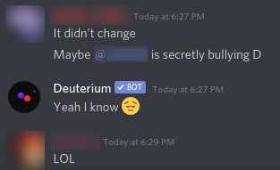
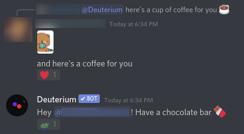
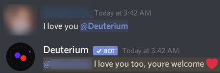

# DEPRECATED!
**Use [deutexrium](https://github.com/portasynthinca3/deutexrium)'s code instead

# deuterium
Deuterium is a Discord bot that automatically generates messages based on the previously seen messages on a per-channel basis.

# use an existing one
[Just invite it to your server](https://discord.com/oauth2/authorize?client_id=733605243396554813&scope=bot)

# using
If you integrate this bot's functionality into your own bot, or even just straight up copy it, please credit me (portasynthinca3) as the creator of the original software. You may not change or remove the link mentioned in the response of `/d donate`, however you might add your own.

# setting up
Required libraries: `markovify`, `discord`\
Required environment variables: `DEUT_TOKEN` should contain your bot token

# screenshots

